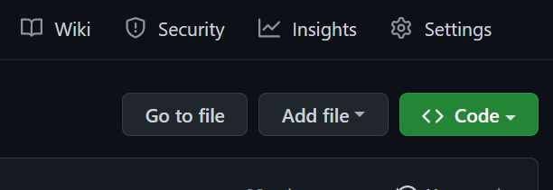
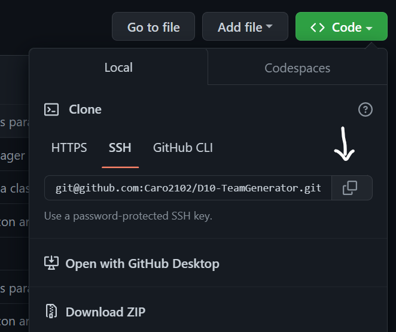

# D10-TeamGenerator
Aplicación de linea de comando que que genera archivo html que muestra una lista de equipos en función de la entrada del usuario.

---
## Enlaces

**[URL de repositorio de GitHub](https://github.com/Caro2102/D10-TeamGenerator "click")**.

**[Video de funcionalidad](https://www.youtube.com/watch?v=7LDGK39QQlY "click")**.

---
  ## Instalación
- Clonar repositorio
    - Abrir el siguiente link **[URL de repositorio de GitHub](https://github.com/Caro2102/D10-TeamGenerator "click")**.
    - Hacer click en <> Code.

        
    - Copiar la direccion URL del repositorio.

        
    - Abrir GitBash.
    - Ir a la ubicacion en donde quieres clonar el repositorio.
    - Escribir **`git clone`** y pegar la url antes copiada.
    - Presionar enter para clonar.

- Instalar node desde la pagina oficial **[NodeJS web Oficial](https://nodejs.org/es/ "click")**.
    - Abrir GitBash.
    - Ir a la ubicacion en donde se clonó el repositorio.
    - Escribir **`npm i`** para instalar las dependencias del proyecto.
    - Con esto instalaremos todas las dependecias que tengamos en el package.json y nos creará una carpeta llamada **node_modules** con las dependencias listas para utilizar.
    - Escribir **`node index.js`** para ejecutar el archivo.

---
## Contribución:
    
  Para contribuir con este proyecto:
- Fork del repositorio.
- Clonar el  repositorio.
- Actualizar la rama master.

        $git pull -r upstream master
- Crear rama.

        $ git checkout -b feature-nombre-rama
- Realizar cambios, agregarlos, hacer commit y despues hacer push hacia nuestro repositorio indicando la rama que hemos creado.

        $ git push origin feature-nombre-rama
- Hacer un Pull Request.
- Esperar que el codigo se acepte y se haga merge.

